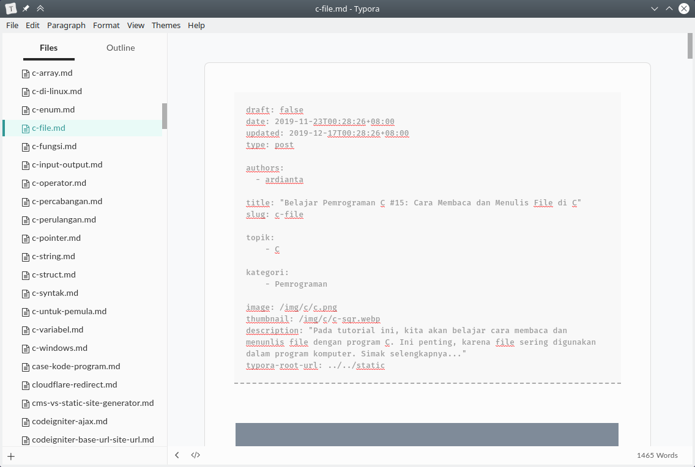
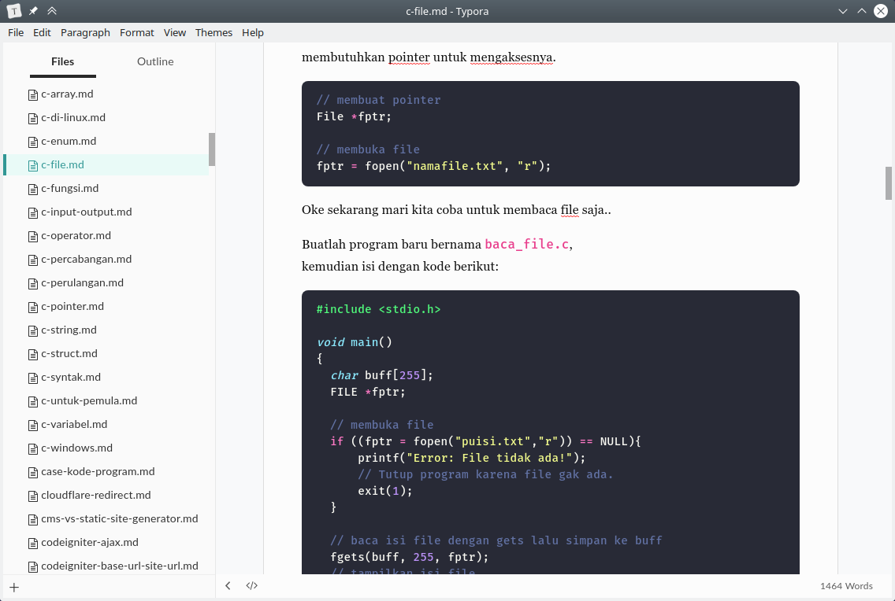

# Petani Kode Typora Theme

This theme are mock of the Petani Kode article style.
Created to make content writing easier.

Example Font-matter view:



Example Sytax highlighting:



For theme preview, please check the 📁 `html-preview` folder.

# Requirement

Fon required `Georgia`, `Lato`, and `Fira mono`. Make sure these font are installed on your system.

> P.S fot next version we will embed these font ([#1](../../issues/1))

# How to Install

First, clone this repository:

```bash
git clone https://github.com/petanikode/typora-petanikode-theme.git
cd typora-petanikode-theme
```

For Linux and Mac user, run the `install.sh` script.

```bash
bash install.sh
```

for Windows user run the `install-windows.bat` script.

```bat
install-windows.bat
```

For manual instalation you can copy/paste the `petanikode` folder and `petanikode.css` file to the Typora theme directory.

## Credits

- [Base Theme from Typora](https://github.com/typora/typora-theme-toolkit)
- Codeblock Highlighting by [dracula/typora](https://github.com/dracula/typora)
